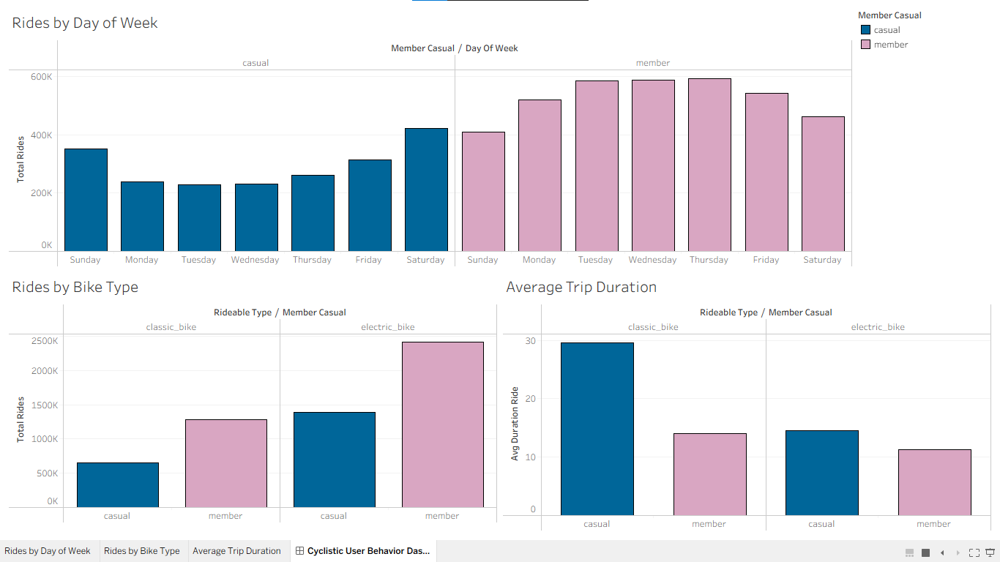

# Cyclistic-Bike-Share-Analysis
Google Data Analytics Capstone Project - Analyzing Cyclistic bike-share data to understand user behavior and drive annual membership. 
# Cyclistic Bike-Share Case Study: From Casual Riders to Annual Members

## 1. Executive Summary
Cyclistic is a successful bike-share program in Chicago. Financial analysis reveals that annual members are much more profitable than casual riders. This case study analyzes historical bike trip data to identify behavioral differences between casual riders and annual members. The ultimate goal is to design a data-driven marketing strategy aimed at converting casual riders into long-term annual members.

---

## 2. Ask Phase (Business Task & Objectives)

### 🔹 The Business Challenge
The marketing director believes the company’s future growth depends on maximizing the number of annual memberships. Casual riders (those using single-ride or full-day passes) already know the Cyclistic brand, but they need a compelling reason to transition to a full membership.

### 🔹 Core Analytical Questions
To guide the marketing strategy, this analysis answers three core questions:
1. How do annual members and casual riders use Cyclistic bikes differently?
2. Why would casual riders buy Cyclistic annual memberships?
3. How can Cyclistic use digital media to influence casual riders to become members?

### 🔹 Objective of this Project
To analyze Cyclistic’s historical trip data to uncover trends and distinct behavioral patterns between user types, and leverage these insights to provide actionable, high-level recommendations for the marketing campaign.
---

## 3. Prepare & Process Phase (Data Tools & Cleaning)

### 🔹 Data Source & Integrity
The analysis utilizes Cyclistic’s historical trip data. Due to the massive volume of the datasets (millions of rows), standard spreadsheet tools like Excel were insufficient to process the data efficiently.

### 🔹 Tech Stack & Tools Used
* Python (Pandas): Used for initial data loading, merging multiple monthly CSV datasets, and structure management.
* SQL (DuckDB / Con.execute): Integrated directly inside the Jupyter Notebook to perform high-speed relational queries, data grouping, and calculations.
* Tableau Public: Applied for final interactive data visualization and executive dashboard design.

### 🔹 Data Cleaning & Transformation Pipeline
1. Data Merging: Unified separate monthly trip files into a single consolidated dataframe (final_trips_data).
2. Feature Engineering: Calculated critical metrics including ride_length (trip duration) and day_of_week.
3. Data Scrubbing: Filtered out anomalies, missing values, and corrupted records (such as negative trip durations or system testing rows) to ensure statistical accuracy.

---

## 4. Analyze Phase (Key SQL Insights)

Using advanced relational SQL queries inside the notebook, critical behavioral metrics were aggregated to compare casual riders against annual members.

### 🔹 Core Query: Vehicle Preferences & Trip Durations
The following SQL query was executed to isolate user preferences regarding bike types and ride behaviors:

`sql
SELECT 
    member_casual,
    rideable_type,
    COUNT(*) AS total_rides,
    ROUND(AVG(ride_length), 2) AS avg_duration_ride
FROM final_trips_data
GROUP BY member_casual, rideable_type
ORDER BY member_casual, total_rides;
---
🔹 Key Findings from the Data Output:
- Leisure vs. Utility: Casual riders show a massive preference for longer trips, averaging 29.59 minutes on classic bikes, which is double the duration of annual members (who average 14.04 minutes).
- The Electric Surge: Annual members exhibit highly consistent, high-frequency usage, logging over 2.41 million rides on electric bikes alone, indicating a strict commuting utility pattern rather than leisure.
---

## 5. Share Phase (Interactive Dashboard & Raw Workbook)

The unified executive dashboard was constructed using Tableau. To provide full transparency and facilitate technical review, the project can be accessed through multiple channels below:

### 🌐 Access Points
* 🔗 Live Interactive Version: [Click Here to View on Tableau Public][https://public.tableau.com/app/profile/mohammed.ismail3566/viz/Cyclistic_Bike_Share_Analysis_17827828307680/CyclisticUserBehaviorDashboard]
* 💾 Download Tableau Workbook: [Download the Raw Cyclistic_Analysis.twbx File](visualizations/Cyclistic_Bike_Share_Analysis.twbx) *(Open via Tableau Desktop or Tableau Public)*

### 📊 Dashboard Preview
Below is a static preview of the executive dashboard layout:

---
